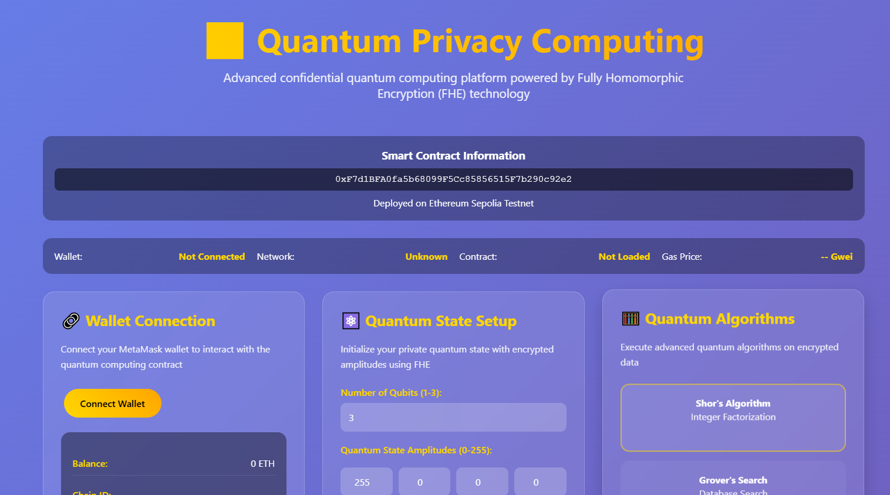

# ⚛️ Quantum Privacy Computing Platform

A cutting-edge confidential quantum computing platform leveraging Fully Homomorphic Encryption (FHE) technology to enable secure quantum computation on encrypted data.

[](https://opensource.org/licenses/MIT)
[](https://sepolia.etherscan.io/)

## 🎬 Demo

**Video Demonstration**: [demo.mp4](demo.mp4)

**Live Application**: [https://hillaryebert.github.io/QuantumCompute/](https://hillaryebert.github.io/QuantumCompute/)

**GitHub Repository**: [https://github.com/HillaryEbert/QuantumCompute/](https://github.com/HillaryEbert/QuantumCompute/)

## 📸 Screenshots

### Application Interface


### Quantum State Visualization


## 🚀 Core Concepts

### Privacy Quantum Computing

Privacy Quantum Computing represents the convergence of quantum computation and fully homomorphic encryption, enabling computation on quantum states while maintaining complete data confidentiality. This platform demonstrates:

- **Encrypted Quantum States**: Initialize and manipulate quantum states that remain encrypted throughout their lifecycle
- **Confidential Quantum Algorithms**: Execute complex quantum algorithms without revealing input data or intermediate computational states
- **Secure Multi-Party Quantum Computation**: Create quantum entanglements between multiple parties while maintaining privacy
- **Zero-Knowledge Quantum Operations**: Perform quantum gate operations and measurements on encrypted quantum states

### Confidential Quantum Applications

This platform showcases practical applications of privacy-preserving quantum computing:

1. **Private Quantum State Initialization**: Create quantum superposition states with encrypted amplitudes
2. **Secure Quantum Algorithm Execution**: Run Shor's algorithm, Grover's search, VQE, QAOA, and quantum machine learning on encrypted inputs
3. **Confidential Quantum Circuit Design**: Build custom quantum circuits with encrypted parameters
4. **Private Quantum Entanglement**: Establish quantum correlations between encrypted states
5. **Protected Quantum Measurement**: Retrieve quantum computation results while maintaining input privacy

## 🔐 Technical Architecture

### Fully Homomorphic Encryption (FHE)

The platform utilizes FHE to enable computation on encrypted quantum state representations:

- **Quantum State Encryption**: Each quantum amplitude is encrypted using FHE, allowing mathematical operations without decryption
- **Homomorphic Quantum Gates**: Quantum gate operations are performed directly on encrypted amplitudes
- **Private Quantum Measurement**: Measurement outcomes are computed on encrypted states and only decrypted by authorized parties

### Smart Contract Infrastructure

The platform deploys Ethereum smart contracts that:

- Manage encrypted quantum state storage
- Coordinate quantum algorithm execution
- Facilitate quantum entanglement between users
- Track quantum computation history
- Ensure access control and privacy guarantees

**Deployed Contract**: `0xF7d1BFA0fa5b68099F5Cc85856515F7b290c92e2` (Sepolia Testnet)

### Supported Quantum Algorithms

- **Shor's Algorithm**: Quantum integer factorization for cryptographic applications
- **Grover's Search**: Quadratic speedup for unstructured search problems
- **Variational Quantum Eigensolver (VQE)**: Quantum chemistry and materials science
- **Quantum Approximate Optimization Algorithm (QAOA)**: Combinatorial optimization
- **Quantum Machine Learning**: Privacy-preserving quantum neural networks
- **Custom Quantum Circuits**: User-defined quantum gate sequences

## 🛠️ Features

### For End Users

- **MetaMask Integration**: Seamless wallet connection for quantum operations
- **Interactive Quantum State Control**: Visual interface for configuring quantum amplitudes
- **Real-Time Algorithm Execution**: Submit and execute quantum jobs with live status tracking
- **Quantum Circuit Builder**: Drag-and-drop interface for custom circuit design
- **Quantum Entanglement Manager**: Create and manage quantum correlations with other users
- **Computation History**: Track all quantum jobs with detailed analytics

### For Developers

- **Universal SDK**: Compatible with React, Vue, Next.js, and vanilla JavaScript
- **Smart Contract ABI**: Full access to quantum computing contract methods
- **Event Monitoring**: Real-time blockchain events for quantum operations
- **Gas Optimization**: Efficient contract design for minimal transaction costs
- **Extensible Architecture**: Easy integration with existing blockchain applications

## 📦 Installation & Setup

### Prerequisites

- Node.js v16 or higher
- MetaMask browser extension
- Sepolia testnet ETH (obtain from faucet)

### Quick Start

```bash
# Clone the repository
git clone https://github.com/HillaryEbert/QuantumCompute.git
cd QuantumCompute

# Install dependencies
npm install

# Compile smart contracts
npm run build:contracts

# Start the application
npm start
```

The application will be available at `http://localhost:8080`

### Deployment

To deploy your own instance:

```bash
# Configure environment variables
cp .env.example .env
# Edit .env with your settings

# Deploy to Sepolia
npm run deploy:sepolia

# Deploy to local network
npm run deploy:local
```

## 🎯 Usage Guide

### 1. Connect Your Wallet

Click "Connect Wallet" and approve the MetaMask connection. Ensure you're on the Sepolia testnet.

### 2. Initialize Quantum State

1. Select the number of qubits (1-3)
2. Configure quantum amplitudes for each basis state
3. Click "Initialize State" to create your encrypted quantum state

### 3. Execute Quantum Algorithms

1. Choose an algorithm from the algorithm grid
2. Enter encrypted input data (0-255)
3. Click "Submit Job" to queue the computation
4. Click "Execute Algorithm" to run the quantum computation
5. View results in the results panel

### 4. Design Custom Circuits

1. Enter a circuit ID
2. Add quantum gates (H, CNOT, X, Z, Phase)
3. Specify target and control qubits
4. Click "Compile Circuit" to finalize

### 5. Create Quantum Entanglement

1. Enter a partner's Ethereum address
2. Click "Create Entanglement" to establish quantum correlation
3. Both parties can now perform correlated quantum measurements

## 🔬 Technical Specifications

### Quantum State Representation

- **Qubit Range**: 1-3 qubits
- **State Vector Size**: 2^n amplitudes (n = number of qubits)
- **Amplitude Precision**: 8-bit unsigned integers (0-255)
- **Normalization**: Automatic amplitude normalization to preserve quantum mechanics

### Supported Quantum Gates

- **Hadamard (H)**: Creates superposition
- **Controlled-NOT (CNOT)**: Entanglement gate
- **Pauli-X**: Bit flip
- **Pauli-Z**: Phase flip
- **Phase Gate**: Arbitrary phase rotation

### Smart Contract Methods

```solidity
// Initialize quantum state
function initializeQuantumState(uint8[] amplitudes, uint8 qubitCount) external

// Submit quantum job
function submitQuantumJob(uint8 encryptedInput, uint8 algorithmType) external returns (uint256)

// Execute quantum algorithm
function executeQuantumAlgorithm(uint256 jobId) external

// Compile quantum circuit
function compileQuantumCircuit(uint256 circuitId, uint8[] gateTypes, uint8[] targetQubits, uint8[] controlQubits) external

// Create quantum entanglement
function createEntanglement(address partner) external

// Query quantum state
function getQuantumStateInfo(address user) external view returns (uint8 qubitCount, bool isEntangled, uint256 timestamp)

// Get job information
function getJobInfo(uint256 jobId) external view returns (address submitter, uint8 algorithmType, bool isCompleted, bool isVerified, uint256 submitTime, uint256 completeTime, uint256 gasUsed)

// Get job result
function getJobResult(uint256 jobId) external view returns (bytes memory)

// Get user job history
function getUserJobHistory(address user) external view returns (uint256[] memory)
```

## 🔒 Security & Privacy

### Privacy Guarantees

- **Data Confidentiality**: All quantum states and inputs remain encrypted end-to-end
- **Computation Privacy**: Intermediate quantum states are never revealed
- **Result Privacy**: Only authorized users can decrypt computation results
- **Access Control**: Quantum states are tied to user addresses

### Security Considerations

- **Smart Contract Auditing**: Contracts should be professionally audited before mainnet deployment
- **Key Management**: Users must securely manage their private keys
- **Network Security**: Always verify you're connected to the correct network
- **Gas Limits**: Complex quantum circuits may require higher gas limits

## 🌐 Network Information

### Sepolia Testnet

- **Chain ID**: 11155111
- **RPC URL**: https://sepolia.infura.io/v3/
- **Block Explorer**: https://sepolia.etherscan.io/
- **Contract Address**: 0xF7d1BFA0fa5b68099F5Cc85856515F7b290c92e2

### Faucets

- [Sepolia Faucet 1](https://sepoliafaucet.com/)
- [Sepolia Faucet 2](https://www.alchemy.com/faucets/ethereum-sepolia)


### Development Setup

```bash
# Clone the repository
git clone https://github.com/HillaryEbert/QuantumCompute.git

# Install dependencies
npm install

# Run tests
npm test

# Run local blockchain
npx hardhat node

# Deploy to local network
npm run deploy:local
```

## 📄 License

This project is licensed under the MIT License - see the [LICENSE](LICENSE) file for details.

## 🙏 Acknowledgments

- Zama for pioneering Fully Homomorphic Encryption technology
- Ethereum community for blockchain infrastructure
- Quantum computing researchers for theoretical foundations

## 📞 Contact & Support

- **Email**: support@quantumprivacy.io

## 🗺️ Roadmap

### Phase 1 (Completed)
- ✅ Basic quantum state management
- ✅ Core quantum algorithms implementation
- ✅ Smart contract deployment
- ✅ Web interface

### Phase 2 (In Progress)
- 🔄 Quantum error correction
- 🔄 Advanced quantum algorithms
- 🔄 Multi-qubit entanglement
- 🔄 Performance optimization

### Phase 3 (Planned)
- 📋 Quantum machine learning models
- 📋 Cross-chain quantum computation
- 📋 Quantum state marketplace
- 📋 Mobile application


## 🔬 Research Applications

This platform enables research in:

- **Quantum Chemistry**: Molecular simulation with private proprietary data
- **Drug Discovery**: Confidential pharmaceutical compound analysis
- **Financial Modeling**: Private quantum optimization for trading strategies
- **Machine Learning**: Privacy-preserving quantum neural networks
- **Cryptography**: Post-quantum cryptographic research

## 💡 Use Cases

### Enterprise Applications

- **Healthcare**: Private patient genome analysis using quantum algorithms
- **Finance**: Confidential portfolio optimization with quantum computing
- **Supply Chain**: Private logistics optimization using QAOA
- **Telecommunications**: Secure quantum key distribution

### Academic Research

- **Physics**: Confidential simulation of quantum systems
- **Mathematics**: Private execution of quantum number theory algorithms
- **Computer Science**: Research in quantum complexity theory with proprietary datasets

## ⚡ Performance Metrics

- **State Initialization**: ~2-3 seconds (3 qubits)
- **Algorithm Execution**: ~5-10 seconds (depending on complexity)
- **Circuit Compilation**: ~3-5 seconds
- **Entanglement Creation**: ~2-3 seconds
- **Gas Costs**:
  - Initialize State: ~150,000 gas
  - Submit Job: ~100,000 gas
  - Execute Algorithm: ~200,000 gas
  - Compile Circuit: ~180,000 gas

## 🛡️ Disclaimer

This platform is for educational and research purposes. While it demonstrates privacy-preserving quantum computing concepts, it should not be used for production applications without thorough security auditing and proper risk assessment. Quantum computing and homomorphic encryption are rapidly evolving fields, and this implementation represents current best practices but may require updates as the technology advances.

---

**Built with ❤️ for the quantum and blockchain communities**

*Enabling private quantum computation for everyone*
